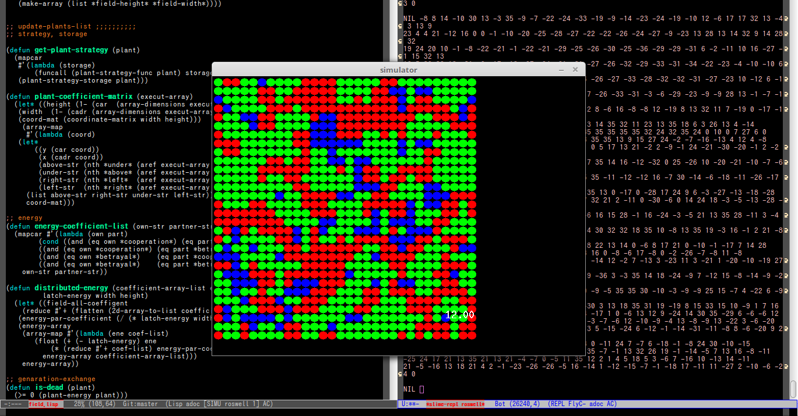

# game-theory-simulator 


2d expanded Prisoner's dilemma simulator.

### install and run
to install this simulator, you need
- common-lisp (I tested sbcl 1.3)
- SDL environment (this simulator depends to [lispbuilder-sdl](https://github.com/lispbuilder/lispbuilder))

the way to running this simulator

1. inform where this directory is to the ASDF/common lisp
`
(push #P"/where/this/directory/game-theory-simulator/" asdf:*central-registry*)
`
don't forget end of path-string '/'

1. using asdf loadsystem to load this package
`
(asdf:operate 'asdf:load-op :GAME-THEORY-SIMULATOR)
`
1. in to package 
`(in-package :game-theory-simulator)`
1. to run simulator,
`(UI)`


### rule 

```
-------
|A|A|A|
-------
|A|@|A|
-------
|A|A|A|
-------
```

- `A` or `@` means `plant` planted in cell.
- each `cell` has `energy` to feed `plant`. 
- `plant` deel `energy` to adjoing plants
  - deel is `cooperation` or `betrayal`
  - after deeling, plants get energy rerated to gain table
  - gain table is shown in `src/rule.lisp` of  `energy-coefficient-list`
  - in default rule of `4e2165e` , it is very lucrative to `betrayal nist`
- `energy` of the `cell` is too lower than adjoining `cell`, plant of the `cell` is changed to highest `energy` plant.
- `plant` memories strategies of adjoining `plants`
  - `plant` can decide deel (`cooperation` or `betrayal`) refer to memories


### simulation results
[documents directory](./documents/)
(todo)

### todo
- executeable file
- javascript GUI
- more useful GUI
- debug / source refactoring
- Consideration by many rule-parameters
- to configure rules easily
- documentations of Prisoner's dilemma

